## Hi there 👋, I'm Byron

Welcome to my Github Profile! 
I'm passionate about building useful 
software, learning new tech, and 
contributing to open source.

👋 Hi, I’m currently the CTO & Lead Architect at an AI-driven SaaS startup based in Melbourne, where I specialize in architecting scalable cloud-based platforms and steering the product’s technical direction

💻 My background is in software engineering with a strong emphasis on DevOps, containers, and cloud-native infrastructure.

🚀 I’m passionate about building reliable, scalable applications and continuously upskilling in emerging technologies to stay ahead of the curve.

---

## 🧰 Tech Stack

### Frontend

### Backend

### DevOps & Cloud

### Tools & Platforms

---

